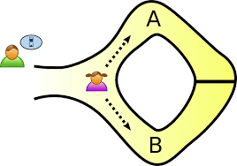

# The Transparency-Privacy Trade Off

When creating a blockchain, one question arises : **do we prefer security or transparency** ?

# The Current Landscape

Most current public blockchains (like Bitcoin or Ethereum) opted for **transparency** of transactions, where data is visible to everyone. Using an *explorer*, everyone can see what transactions have been made and all their details (time, amount, parties involved, …). This discourages bad actors to engage in fraudulent activities without being detected and fosters trust among users.  


💡

Recently, a group of North-Korean hackers cashed out hundreds of millions from the $1.5bn ByBit hack. The funny thing is that you could see at all times were the money was and where it was going


Users are identified by pseudonymous addresses rather than real-world identities. Thus, one can see for example that user `0xcd278f` sent 1 $BTC to `0xf35jdw` but he doesn’t know who these two users really are. This makes the blockchain private, right ? Not really…

Even though addresses are pseudonymous, transaction patterns can be analyzed to link different addresses to the same user. For example, if multiple addresses frequently interact with each other, they might belong to the same entity.

Also, many exchanges (such as Binance, Kraken, etc.) require users to undergo what is called a  *Know Your Customer* (KYC) and *Anti-Money Laundering* (AML) procedures where you have to provide information about you real-world identity. This enables the link of pseudonymous addresses to real-world identities. Law enforcement agencies can request data from exchanges and service providers, which can be used to de-anonymize users. 

# A Psychological Dilemma

The transparency/privacy battle translates a psychological dilemma

- On one hand, we need **transparency** to protect ourselves from malicious actors. Regulators and law enforcement need to be able to protect customers by preventing fraud, track illicit activities and detain criminals. If something illegal happens on-chain, they need transparency to be able to identify the person behind the attack.
- On the other hand, we want **privacy** to safeguard personal and sensitive information from unwarranted exposure. Individuals and businesses need to protect their financial data, proprietary information, and personal communications from surveillance, unauthorized access, and potential misuse. Privacy ensures that users maintain control over their data, fostering trust and security in digital interactions.

# Solutions

## Private Blockchains - A Privacy Focused Approach

Another solution are private blockchains. A private, or permissioned,  blockchain is a type of blockchain that is restricted to a group of participants who have been granted permission to access the network, contrary to public blockchains who are accessible to everyone. To gain access to a private blockchain , individuals must receive an invitation and verify their identity (KYC) or provide the necessary information. This means that malicious users are much more rare and if any problem arises, personal information of users is disponible. 

However, private blockchains are often centralized where a single organization controls the network. This centralization can be problematic since it goes against the core principle of decentralization, which is one of the fundamental concepts of blockchain technology. Another disadvantage of private blockchains  is that they are more vulnerable than public blockchains to security risks. Indeed,  because there are fewer nodes (computers) in the centralized network, if a hacker gains access to a private blockchain, they can manipulate data or block transactions.

## ZK Proofs - A Miracle Solution

The preferred solution to the privacy dilemma is the use of zero-knowledge proofs (or ZKPs). ZKPs are a complex cryptographic tool that basically enable anyone to prove that a statement is true, without revealing the content of the statement. 

They work as follows : 

Imagine a circular cave with two separate entrances (A and B connected by a locked door inside. You know the secret code to open the door inside the cave, but your friend is skeptical that you really know it. You want to prove it **without actually revealing the code**. Here's how you do it:

```
1) You enter the cave randomly by either path A or path B, without your friend noticing.
2) Your friend that is waiting outside randomly tells you to exit either from the left (A) or right (B) entrance.
If you truly know the secret code to the door, you can always open it and exit from the side your friend chooses. If you're guessing, you only have a 50% chance each time.
3) Repeat the process n times. The probability that you are lying goes like 0.5^{n} so your friend only 10 tries to be more than 99% sure that you are not cheating

```



By repeating this process several times, your friend becomes certain that you must know the code, yet you've never actually revealed it. This is precisely how a zero-knowledge proof works in concept. That's the essence and the power of ZK proofs!

In the context of blockchain, ZKPs enable the validation of a transaction (or even multiple transactions) without disclosing the underlying data. Thus, transaction amounts or participant identities remain confidential
💡

Implementing ZKPs can improve the **scalability** of a blockchain by reducing the amount of data that needs to be processed and stored. This is because ZKPs can aggregate multiple transactions into a single proof, which can then be verified in one go.

AlephZero is a blockchain that directly integrates ZKPs into its blockchain architecture. It allows anyone to verify that the network rules are being followed without accessing sensitive data. This, public verifiability of transactions is maintained. Aleph Zero's implementation of ZKPs allows it to comply with regulatory requirements, such as these anti-money laundering (AML) rules, without compromising user privacy. Auditors can verify the integrity of transactions without needing access to detailed transaction data.