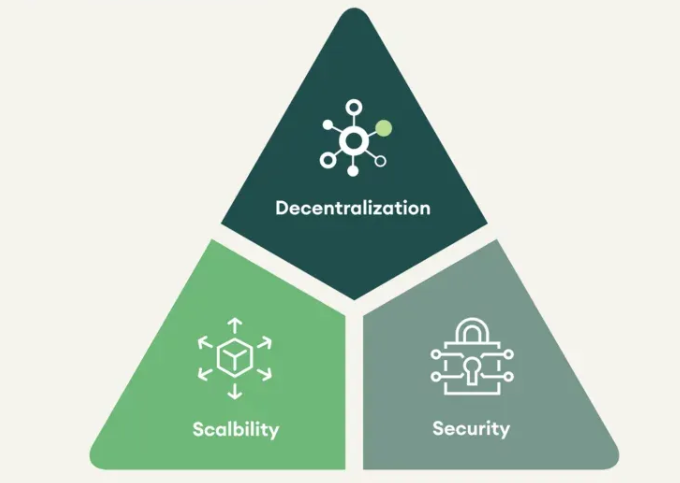

# Aleph Zero : Pioneering Privacy in Blockchain

AlephZero is a high performance privacy-enhancing L1. It has emerged as a leader in addressing blockchain’s privacy challenges by integrating advanced cryptographic techniques to ensure secure and private transactions. This article delves into the technical innovations Aleph Zero employs to enhance privacy.

# The need for privacy

As explained in the previous article, traditional blockchains operate on a pseudo-anonymous basis, where transaction details are publicly accessible and can potentially be traced back to individuals. There is then a need for robust privacy solutions that protect user data without sacrificing the other benefits of blockchain technology

💡

Aleph Zero’s original chain supported app is written in **Rust**, a language known for its memory safety, performance, and concurrency support. Rust is also used by other high-performance blockchain networks like **Polkadot** and **Solana**, highlighting its suitability for scalable and secure blockchain applications. Since then, Aleph Zero has expanded into the EVM to support a wide range of existing applications in the Ethereum ecosystem and beyond

# Aleph Zero’s approach to privacy

Aleph Zero addresses blockchain privacy challenges through a multifaceted strategy that combines high performance with advanced cryptographic methods :

1. Zero-knowledge proofs (ZKPs)
2. Secure multi-party computation (sMPC)
3. zkOS, a privacy framework designed to provide comprehensive privacy solutions.

## **Zero-Knowledge Proofs (ZKPs)**

As described in the previous article, ZKPs enable one party to prove knowledge of specific information to another party without revealing the information itself, thus maintaining the confidentiality of a transaction.

## **Secure Multi-Party Computation (sMPC)**

Secure Multi-Party Computation (sMPC) enables multiple parties to jointly compute a function over their inputs while keeping those inputs private. You can then achieve collaborative decision-making without exposing sensitive data.

Technically, Aleph Zero’s implementation of sMPC is used to distribute cryptographic operations across multiple nodes, ensuring that no single entity has complete visibility over private transactions. You can then reduce the risk of data leaks and unauthorized access. Unlike traditional blockchain architectures where transaction data is either fully public or shielded by a single entity, Aleph Zero's sMPC approach allows for **trustless privacy**, meaning that even network participants processing transactions do not have access to the underlying sensitive information.

💡

By combining ZKPs and sMPC, Aleph Zero creates a **multi-layered privacy system**, ensuring that users can interact securely with decentralized applications (dApps)

## **zkOS: The Privacy Framework**

zkOS serves as the cornerstone of Aleph Zero's privacy architecture. It is a developer-centric framework designed to integrate confidentiality features seamlessly into decentralized applications (dApps). The main advantage is that zkOS offers **client-side** ZK privacy, enabling users to maintain control over their data and execute private transactions efficiently.

Additionally, Aleph Zero utilizes one-time accounts, meaning that when users connect to a dApp, they generate a temporary wallet. Then, they top it up from their shielded account before proceeding as usual. It becomes then practically impossible to trace individual users from transaction history.

# Technical innovations pushed by Aleph Zero

Aleph Zero's commitment to privacy is evident in several technical innovations:

### Client-Side vs. Server-Side Zero-Knowledge Proving

Aleph Zero distinguishes between client-side and server-side ZK proving. Client-side proving involves computations performed on the user's device, offering enhanced data protection and privacy. In contrast, server-side proving involves computations by external parties and is typically used L2 solutions for example. By focusing on client-side ZK proving, Aleph Zero empowers users with greater control over their data and reduces reliance on external validators.

### Solving ZKPs challenges

Implementing ZKPs in blockchain systems presents several challenges, including computational intensity, complexity, and usability concerns. Aleph Zero tackles these issues through:

- **Optimized Cryptographic Operations**: By refining on-chain cryptographic processes, Aleph Zero minimizes computational overhead, resulting in faster and more efficient transactions.
- **Interoperability Solutions**: Aleph Zero facilitates cross-chain interactions through wrapped assets, addressing interoperability challenges associated with rapidly evolving ZKP technologies.
- **Regulatory Compliance**: Incorporating features like ZK-ID for KYC verification, Aleph Zero ensures that privacy solutions align with regulatory standards, balancing user privacy with compliance requirements.

### Shielded Transactions and the Shielding Demo

To demonstrate the capabilities of zkOS, Aleph Zero introduced the Shielding Demo on its testnet. This feature allows users to "shield" their tokens, effectively hiding transaction details from public view. The Shielding Demo utilizes a shielded pool primitive, enabling users to deposit and withdraw tokens without linking transactions to their identities. As explained above, this mechanism ensures comprehensive on-chain privacy and serves as a practical example of zkOS's potential.

### Scalability Through AlephBFT and DAG

Aleph Zero chose a unique combination of **AlephBFT** (a Byzantine Fault Tolerant consensus protocol) and a **Directed Acyclic Graph (DAG)** architecture. Unlike traditional blockchains, Aleph Zero allows for transaction finalization without requiring all nodes to be fully synchronized, improving efficiency and scalability.

Ethereum has attempted to implement ZKPs, but these solutions have often been slow due to the high computational requirements of proof generation and verification (and also by the slow and cautious approach taken by the Ethereum Foundation). Aleph Zero overcomes these limitations by integrating ZKPs directly into its scalable architecture.

However, this scalability improvement comes at the cost of decentralization. Aleph Zero currently operates with around **170 nodes spread across five countries**, making it more centralized compared to fully permission-less networks. 

💡

Aleph Zero chose **scalability** and **security**, thus unfortunately lacking decentralization as illustrated by the famous *Trillema of a Blockchain* which indicates that blockchains must sacrifice one of the characteristics to achieve the other two.

The Trillema of Blockchains (Source :  SEBA Bank AG)